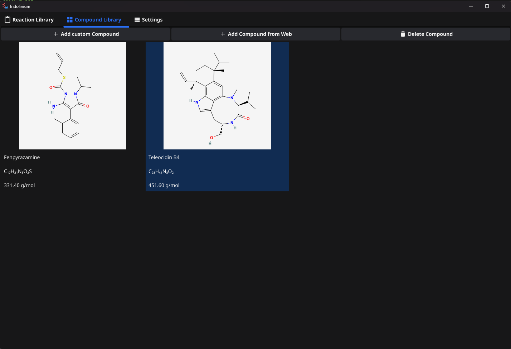
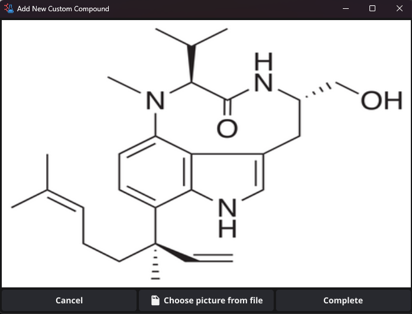
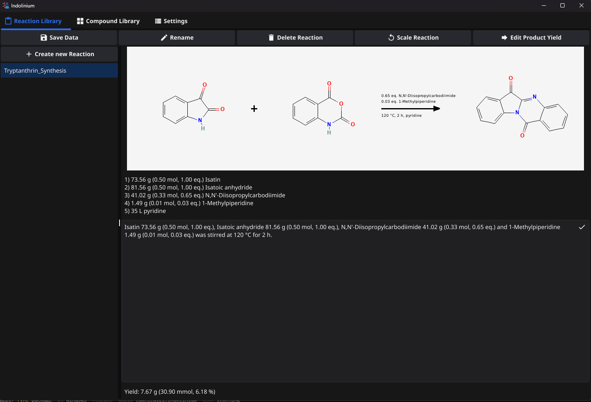

# Indolinium

> **Indolinium** is a Windows app designed as a electronic lab journal
> Fast, efficient, and focused on user-friendliness.

---

## 🚀 Download

👉 **[Download Indolinium](releases/Indolinium.exe)**  

*(Click the link to download the latest version.)*

---

## 🖼️ Screenshots

|  |  |
|:--:|:--:|
| **Create your own compound library** | **Add new compounds from image files** |

  
*Design reactions in the reaction library*

---

## 🔧 Features

- ✅ **Electronic Lab Journal** Design and keep track of all your synthesis experiments.
- 📊 **Automatic reaction scheme** Draws a reaction scheme based on the components which you select.
- ⚡ **High performance** through native execution   
- 💾 **Portable** – no installation required  

---

## 💡 Installation

1. Download **Indolinium.exe** from the link above.  
2. Run it directly (no setup needed).  
3. Follow the on-screen instructions.  

---

## 🧑‍💻 About the Project

Feedback and suggestions are always welcome!

📫 **Contact:** [your.email@example.com](mailto:your.email@example.com)

---

© 2025 **Indolinium Project** — All rights reserved.
